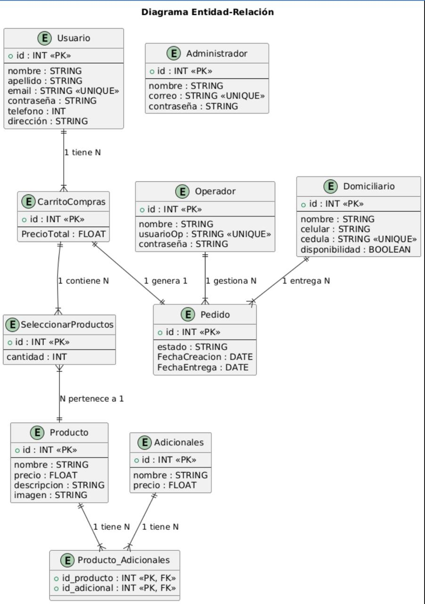
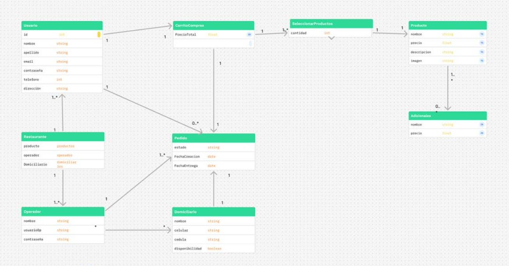

**Restaurante Japonés - Proyecto (Hanami)**  
**Integrantes:**   
Eduardo De Brigard Carreño, 
Juan Romero Plata, 
Edward Quintero Palma   
Este proyecto consiste en una plataforma web para un restaurante japonés. Los usuarios pueden explorar un sinfín de productos personalizables para su experiencia culinaria. Además, los empleados tienen acceso a un portal exclusivo para gestionar de manera eficiente las actividades del restaurante.

**Tecnologías Utilizadas**  
Frontend: HTML, CSS 
Backend: Spring Boot 
Base de Datos: H2  
JPA (Java Persistence API) para la gestión de entidades en la base de datos. 

**Funcionalidades**  
Portal exclusivo para gestionar pedidos, inventarios y operaciones del restaurante.
Acceso a estadísticas y reportes de ventas. 

**Paleta de Colores:**  
Negro: #000000 (para texto y detalles importantes) 
Blanco: #FFFFFF (para fondos y áreas de contraste) 
Dorado: #FFD700 (para resaltar elementos clave y detalles) 

**Tipo de Letra**  
El tipo de letra utilizado en el diseño es Poltowski Nowy, que aporta una apariencia elegante y moderna al sitio web. Asegúrate de incluir este tipo de letra en el archivo CSS.  

a continuación exponemos los diagramas usados para el desarrollo de la pagina de nuestro restaurante: 
**Diagrama Entidad-Relación:**  

  

 

**Diagrama de Clases:**  

  

 

